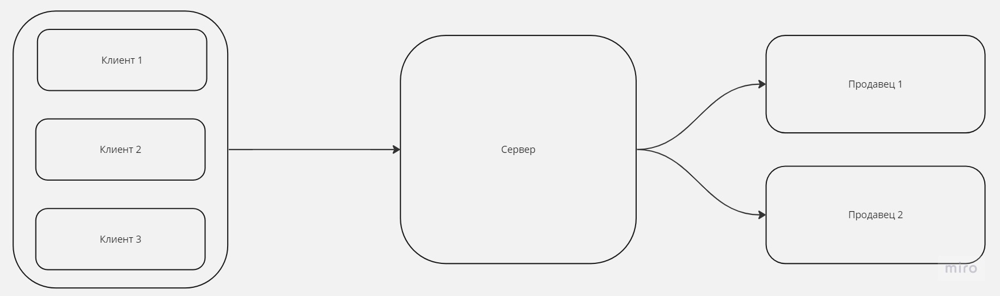
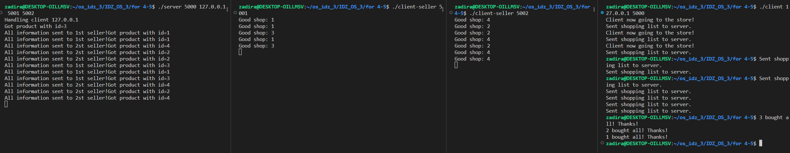

# ИДЗ ОС 3
Выполнил Парахин Николай Викторович, БПИ 212

Вариант 20

Условие:
Задача о магазине – 2 (забывчивые покупатели). В магазине работают два отдела, каждый отдел обладает уникальным ассортиментом. В каждом отделе работает один продавец. В магазин ходят исключительно забывчивые покупатели, поэтому каждый покупатель носит с собой список товаров, которые желает купить. Покупатель приобретает товары точно в том порядке, в каком они записаны в его списке. При этом товары в списке расположены в случайном порядке, что заставляет покупателя переходить от отдела к отделу, если это требуется для совершения покупок. Продавец может обслужить только одного покупателя за раз. Покупатель, вставший в очередь, засыпает пока не дойдет до продавца. Продавец засыпает, если в его отделе нет покупателей, и просыпается, если появится хотя бы один. Создать приложение, моделирующее работу магазина в течение рабочего дня. Каждый продавецц — клиент. Покупатели изначально порождаются отдельным клиентом. Сервер обеспечивает взаимодействие покупателей и клиентов.

## На 4-5 балла

Программа, написанная на данную оценку находится [здесь](for%204-5).
Данная программа реализует схему, которую можно нарисовать следующим образом:

[client.c](for%204-5/client.c) реализует клиентов, создает множество процессов и назначает каждому корзину для покупок.

[server.c](for%204-5/server.c) реализует сервер, который распределяет запрос на покупку на нужного продавца.

[client-seller.c](for%204-5/client-seller.c) реализует клиента, который принимает от сервера запрос на покупку товара, и обрабатывает его.

Замечу, что необходимо при запуске программы запустить два раза [client-seller.c](for%204-5/client-seller.c) с разными портами, которые затем необходимо будет передать серверу. Также серверу в аргументы необходимо передать адрес сервера, на котором находятся продовцы.

### Запуск

Команды ниже помогут при запуске приложения:
```bash
# сервер
./server 5000 127.0.0.1 5001 5002
```

```bash
# продавец 1
./client-seller 5001
```

```bash
# продавец 2
./client-seller 5002
```

```bash
# клиенты
./client 127.0.0.1 5000
```

### Тестирование

При тестировании были получены следующие результаты:
